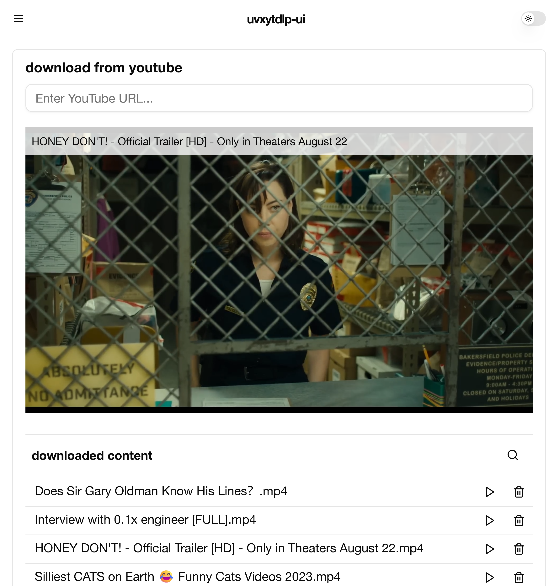
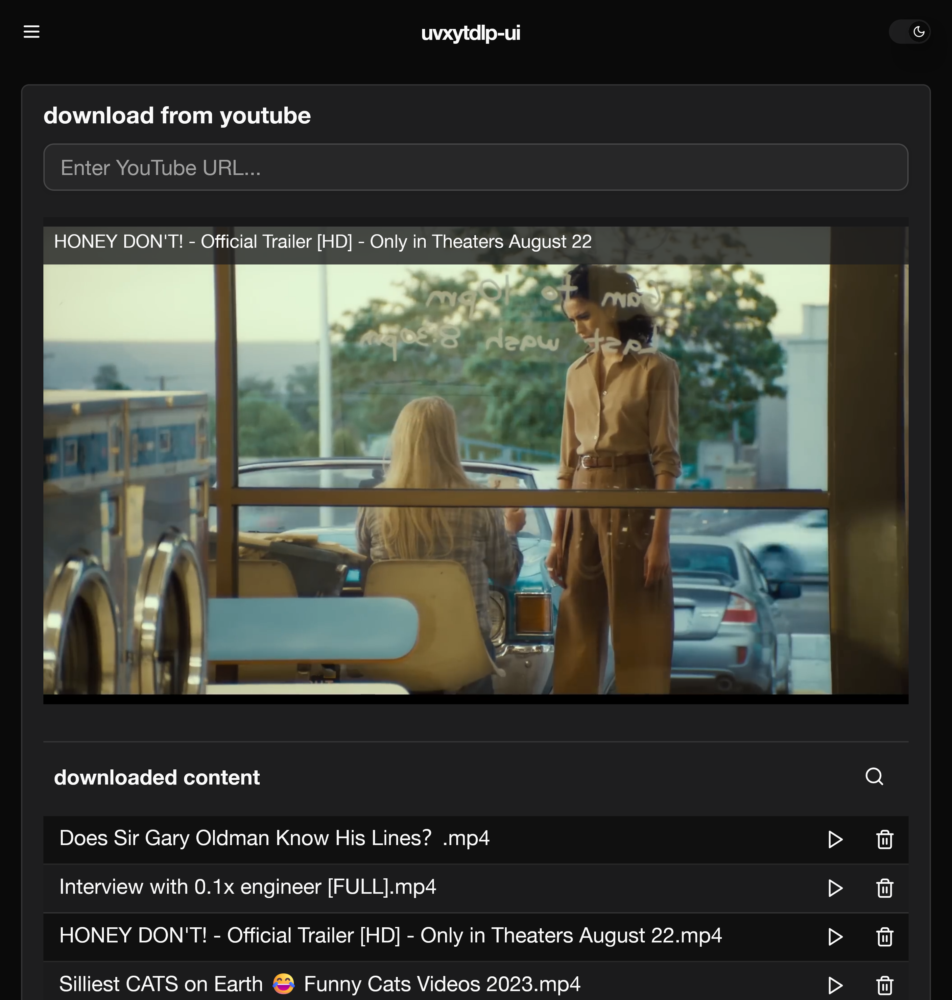
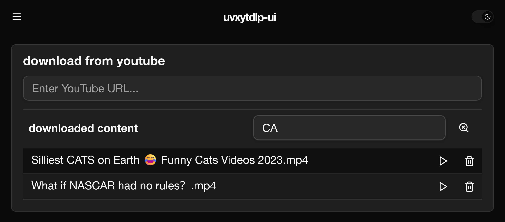
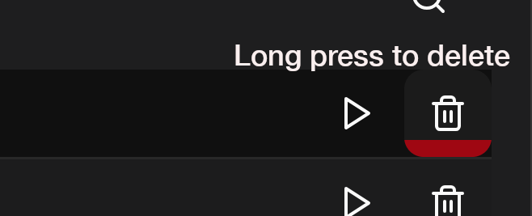

# uvxytdlp-ui

[](https://github.com/ocodo/uvxytlp/pkgs/container/uvxytdlp%2Fuvxytdlp-ui)

Download and playback YouTube videos locally, powered by [yt-dlp](https://github.com/yt-dlp/yt-dlp), [uvx](https://astral.sh/uv) with [Vite](https://vitejs.dev), [React](https://react.dev), [Tailwind CSS](https://tailwindcss.com), [Shadcn/ui](https://ui.shadcn.com) and [FastAPI](https://fastapi.tiangolo.com/) providing the WebUI and API Service.

### screenshots

Light mode



Dark mode



Search downloads



Safe delete with long press




# Run

Using Docker or Podman...

```bash
sudo docker run -d \
  -p 8080:80 \
  -p 5150:8000 \
  -v /path/to/your/downloads:/ytdlp-downloads \
  -v /path/to/your/server_config:/var/www/html/server_config \
  --name uvxytdlp-ui-container \
  ghcr.io/ocodo/uvxytdlp/uvxytdlp-ui:decontaminated-shortcake
  # -v to server_config is optional if you can use
  # 8000 5000 or 5150 for the api port (see below)
```

Then go to http://localhost:8080

# Custom API service port

**Important Note:** The WebUI will look for the service on `5000`, `8000` or `5150`,  If you have to use a different port, you can add info via a mount point in the docker container `/var/www/html/server_config`

You'd add a line to the `sudo docker run` command above:

```bash
-v /your_path:/var/www/html/server_config
```

In `/your_path` place `server.json` containing `{"port": "<your port>"}`

For example I use `~/.config/uvxytdlp/server.json`

Then my `-v` into the container is:

```bash
-v ~/.config/uvxytdlp:/var/www/html/server_config
```

- - -

# Local Dev version

## Run

### Front End

run from project root:

```sh
pnpm install
vite [--port <your port>] [--host <0.0.0.0>]
```

### Back End

The backend uses `uvx` to fetch a fresh version of `yt-dlp` daily.

Install `uv` (to get `uvx`)

```sh
curl -LsSf https://astral.sh/uv/install.sh | sh
```
```sh
cd apiserver
```

Copy `config.example.toml` to `config.toml` and edit it to set the download folder.

```sh
uv venv
source .venv/bin/activate
fastapi dev
```

See `fastapi --help` for other options.

### Running in Docker/Podman

To build the container:

```sh
docker build -t uvxytdlp-ui .
```

(for Podman it's the same, replace `docker` with `podman`)

To run with `uvxytdlp-ui` note downloads in the container are at is `/ytdlp-downloads/`. use `-v your_dir:/ytdlp-downloads` in you podman/docker run command: e.g.:

```sh
docker run -d -p 8080:80 -p 5150:5000 -v $local_download_dir:/ytdlp-downloads --name uvxytdlp-ui-container uvxytdlp-ui
```

#### Start/Stop docker container

```sh
docker start uvxytdlp-ui-container
```

or

```sh
docker stop uvxytdlp-ui-container
```
